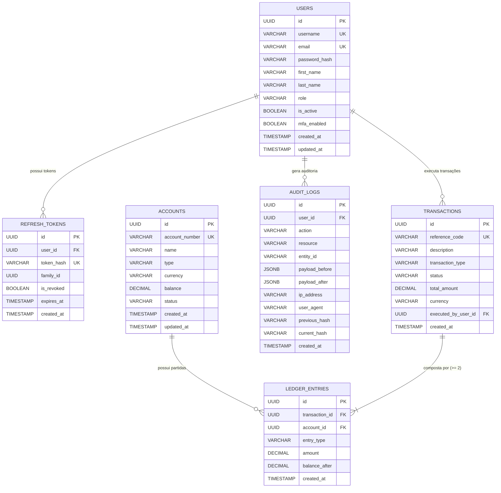

# ✦ VAULTLEDGER CORE — BLUEPRINT OFICIAL ✦
## Enterprise Double-Entry Financial Engine & Security Platform

> **Portfólio Profissional — Projeto 19**  
> **Repositório GitHub:** `https://github.com/alxnrocha/java-secure-platform`  
> **Stack:** React 19 • TypeScript 5.8 • Vite 8 • Tailwind CSS v4 • Java 21 LTS • Spring Boot 3.3+ • Spring Security 6 (Stateless RSA JWT + Refresh Rotation) • PostgreSQL 17 • Redis 7 • Flyway • Testcontainers • MapStruct • TanStack Table v8 • Recharts • JUnit 5 • Vitest

---

## 1. Visão Executiva do Produto

**VaultLedger** é uma plataforma financeira corporativa de **Livro Razão de Partida Dobrada (Double-Entry General Ledger)** e **Controle de Segurança com Trilha de Auditoria Forense Imutável**. Concebida para instituições financeiras, fintechs e departamentos de tesouraria que exigem consistência transacional matemática rigorosa, isolamento RBAC (*Role-Based Access Control*) em quatro camadas e conformidade com normas regulatórias financeiras (SOX / PCI-DSS).

### Pilares de Negócio:
1. **Motor de Partida Dobrada (Double-Entry Engine):** Cada movimentação financeira no sistema é composta por no mínimo duas partidas contábeis balanceadas (um Débito e um Crédito). A soma de todos os débitos deve ser rigorosamente igual à soma de todos os créditos ($\sum Débitos = \sum Créditos$), garantindo conservação de saldo em nível transacional atômico (`SERIALIZABLE`).
2. **Plano de Contas Contábil Completo (Chart of Accounts):** Gestão estruturada de contas categorizadas em cinco naturezas financeiras fundamentais:
   - **ASSET (Ativos):** Caixa Operacional, Tesouraria, Contas a Receber, Liquidez em Custódia.
   - **LIABILITY (Passivos):** Depósitos de Clientes, Obrigações Fiscais, Linhas de Crédito.
   - **EQUITY (Patrimônio Líquido):** Capital Social, Reservas de Lucro.
   - **REVENUE (Receitas):** Taxas de Transação, Spread Cambial, Serviços de Custódia.
   - **EXPENSE (Despesas):** Custos de Liquidação Bancária, Infraestrutura, Taxas de Rede.
3. **Segurança Avançada & Matriz RBAC Granular:**
   - `ROLE_ADMIN`: Gestão total de usuários, auditoria forense, bloqueio de contas e configurações de segurança.
   - `ROLE_OPERATOR`: Execução de transferências atômicas, lançamentos contábeis e depósitos.
   - `ROLE_AUDITOR`: Acesso somente-leitura irrestrito ao Livro Razão, trilha criptográfica de logs e relatórios regulatórios.
   - `ROLE_COMPLIANCE_OFFICER`: Aprovação de transações de alto valor, congelamento preventivo de contas e análise de risco.
4. **Trilha de Auditoria Criptográfica Forense (Tamper-Evident SHA-256 Chain):**
   - Cada mutação de estado no banco de dados gera um registro imutável com o snapshot do estado anterior (`payload_before`), estado atual (`payload_after`), autor, endereço IP e um **Hash SHA-256 encadeado** ao registro anterior (estilo *blockchain light*), tornando qualquer adulteração manual no banco de dados imediatamente detectável.
5. **Autenticação Stateless de Alta Segurança:**
   - Tokens JWT assinados com par de chaves assimétricas **RSA-256** (chaves de 2048-bit).
   - Rotação de Refresh Token no **Redis 7** com detecção automática de reutilização (revogação imediata de toda a família de tokens em caso de tentativa de roubo).

---

## 2. Arquitetura do Sistema

```text
19-java-secure-platform/
├── client/                               # Frontend React 19 + TypeScript + Vite + Tailwind v4
│   ├── src/
│   │   ├── api/                          # Cliente HTTP tipado com suporte a modo Mock Standalone
│   │   ├── assets/                       # Estilos globais e tokens Dark Fintech (Stripe/Brex UI)
│   │   ├── components/
│   │   │   ├── accounts/                 # Chart of Accounts, Saldos por Natureza, AccountCard
│   │   │   ├── ledger/                   # DoubleEntryTable (TanStack Table), DebitCreditBadge, FilterBar
│   │   │   ├── transfer/                 # AtomicTransferModal, DoubleEntryPreview, SolvencyChecker
│   │   │   ├── audit/                    # ForensicAuditLogTable, SHA256ChainInspector, DiffModal
│   │   │   ├── rbac/                     # RoleSwitcher, PermissionMatrixInspector, SecurityShield
│   │   │   ├── analytics/                # BalanceSheetCard, LiquidityFlowChart, TransactionVolumeChart
│   │   │   ├── layout/                   # AppHeader, Sidebar, RoleIndicatorBadge, SecurityStatus
│   │   │   └── ui/                       # Primitivas: Button, Card, Badge, Modal, Input, Select, Toast
│   │   ├── data/                         # Mock datasets realistas para preview perfeito no GitHub Pages
│   │   ├── stores/                       # Zustand 5 (Auth/RBAC State, Ledger Filters, Selected Account)
│   │   ├── types/                        # Interfaces e DTOs TypeScript espelhados no backend
│   │   ├── App.tsx                       # Layout mestre responsivo Dark Fintech
│   │   └── main.tsx                      # Ponto de entrada React
│   ├── package.json
│   ├── tsconfig.json
│   └── vite.config.ts
├── server/                               # Backend Java 21 LTS + Spring Boot 3.3+
│   ├── src/main/java/com/alxnrocha/vaultledger/
│   │   ├── config/                       # SecurityConfig, RsaKeyConfig, RedisConfig, OpenApiConfig, CorsConfig
│   │   ├── controller/                   # AuthController, AccountController, LedgerController, AuditController, MetricsController
│   │   ├── dto/                          # Java 21 Records (TransferRequestDTO, AccountDTO, LedgerEntryDTO, AuditLogDTO)
│   │   ├── entity/                       # JPA Entities (@Entity User, Account, Transaction, LedgerEntry, AuditLog)
│   │   ├── enums/                        # AccountType, EntryType, TransactionStatus, RoleType
│   │   ├── exception/                    # GlobalExceptionHandler (@RestControllerAdvice, RFC 7807)
│   │   ├── mapper/                       # MapStruct Mappers (Entity <-> DTO)
│   │   ├── repository/                   # Spring Data JPA Repositories (JPQL queries com Pessimistic Lock)
│   │   ├── security/                     # JwtTokenService, CustomUserDetailsService, SecurityAuditorAware
│   │   ├── service/                      # LedgerEngineService, AccountService, AuditLogService, AuthService
│   │   └── VaultLedgerApplication.java   # Spring Boot Main Class
│   ├── src/main/resources/
│   │   ├── db/migration/                 # V1__initial_schema.sql, V2__seed_fintech_data.sql (Flyway)
│   │   └── application.yml               # Configuração do datasource, Redis, JWT e Swagger
│   ├── src/test/java/com/alxnrocha/vaultledger/
│   │   ├── integration/                  # Testes com Testcontainers (PostgreSQL 17 + Redis 7)
│   │   └── service/                      # Testes unitários do motor de partida dobrada (JUnit 5 + Mockito)
│   ├── pom.xml                           # Configuração Maven com Java 21, Spring Boot 3.3, Spring Security 6
│   └── mvnw / mvnw.cmd                   # Maven Wrapper para execução independente
├── compose.yaml                          # PostgreSQL 17 Alpine + Redis 7 Alpine + PgAdmin
├── design/
│   ├── mockup.png                        # Mockup oficial de alta fidelidade
│   └── PROMPTS.md                        # Prompts de UI/UX (local, no .gitignore)
├── .github/workflows/deploy.yml          # CI/CD Pipeline (Maven build + Vitest + GitHub Pages)
├── .gitignore
├── BLUEPRINT.md
└── README.md
```

---

## 3. Modelo de Banco de Dados Relacional (PostgreSQL 17)



### Regras de Invariância Contábil & Integridade:
1. **Invariante Fundamental:** Em qualquer transação $T$, a soma das entradas com `entry_type = DEBIT` é exatamente igual à soma das entradas com `entry_type = CREDIT`.
2. **Equação Contábil Geral:** $\text{Ativos} = \text{Passivos} + \text{Patrimônio Líquido} + (\text{Receitas} - \text{Despesas})$.
3. **Controle de Concorrência:** As atualizações de saldo utilizam bloqueio pessimista (`PESSIMISTIC_WRITE`) no banco de dados e isolamento `SERIALIZABLE` para eliminar race conditions em movimentações simultâneas de uma mesma conta.
4. **Imutabilidade do Ledger:** As tabelas `transactions` e `ledger_entries` são estritamente *Append-Only*. Correções de lançamentos são feitas exclusivamente por meio de transações estornadoras (*reversal transactions*).

---

## 4. Matriz de Permissões RBAC (Role-Based Access Control)

| Ação / Endpoint | `ROLE_ADMIN` | `ROLE_OPERATOR` | `ROLE_AUDITOR` | `ROLE_COMPLIANCE_OFFICER` |
|:---|:---:|:---:|:---:|:---:|
| `POST /api/v1/auth/login` | ✅ | ✅ | ✅ | ✅ |
| `GET /api/v1/accounts` | ✅ | ✅ | ✅ | ✅ |
| `POST /api/v1/accounts` (Criar Conta) | ✅ | ❌ | ❌ | ❌ |
| `PATCH /api/v1/accounts/:id/freeze` | ✅ | ❌ | ❌ | ✅ |
| `GET /api/v1/ledger/entries` | ✅ | ✅ | ✅ | ✅ |
| `POST /api/v1/transactions/transfer` | ✅ | ✅ | ❌ | ❌ |
| `POST /api/v1/transactions/reverse` | ✅ | ❌ | ❌ | ✅ |
| `GET /api/v1/audit/logs` | ✅ | ❌ | ✅ | ✅ |
| `GET /api/v1/audit/verify-chain` | ✅ | ❌ | ✅ | ✅ |
| `GET /api/v1/metrics/solvency` | ✅ | ✅ | ✅ | ✅ |

---

## 5. Roteiro de Execução (Milestones & Issues)

| Issue | Tipo & Área | Título da Issue | Escopo & Entregáveis |
|:---:|:---|:---|:---|
| **#1** | `type:feat` `area:infra` | Core Scaffold & Multi-Module Architecture | Maven Java 21 + Spring Boot 3.3, Docker Compose (PostgreSQL 17 + Redis 7), Client React 19 + Tailwind v4 + Vite. |
| **#2** | `type:feat` `area:database` | Relational Database Schema & Flyway Migrations | V1 DDL (`users`, `accounts`, `transactions`, `ledger_entries`, `audit_logs`) e V2 Seeds com plano de contas real. |
| **#3** | `type:feat` `area:security` | Spring Security 6, RSA-256 JWT & RBAC Engine | Stateless JWT RSA-256, Refresh Token rotation no Redis com detecção de reuso, RBAC com 4 papéis estruturados. |
| **#4** | `type:feat` `area:backend` | Double-Entry Ledger Engine & Atomic Transaction Service | Motor de partidas dobradas com validação $\sum D = \sum C$, isolamento de concorrência e lançamentos atômicos. |
| **#5** | `type:feat` `area:security` | Tamper-Evident SHA-256 Forensic Audit Trail | Gravação imutável de logs de auditoria com hash encadeado e verificação de integridade da cadeia forense. |
| **#6** | `type:feat` `area:ui` | Dark Fintech Design System, Layout & Role Switcher | Interface executiva dark fintech (Stripe/Brex), Sidebar, Header com status de segurança e seletor RBAC interativo. |
| **#7** | `type:feat` `area:ui` | Chart of Accounts & Real-Time Ledger Explorer | TanStack Table para exploração do Livro Razão, filtros por natureza contábil, busca instantânea e badges de débito/crédito. |
| **#8** | `type:feat` `area:ui` | Atomic Transfer Terminal & Double-Entry Modal | Terminal de transferência financeira com prévia contábil das partidas dobradas antes de submeter e validação com Zod. |
| **#9** | `type:feat` `area:ui` | Forensic Audit Log Inspector & RBAC Matrix Viewer | Inspetor de trilha de auditoria com validação de hash SHA-256 em tempo real, visualizador de diff JSON e matriz de permissões. |
| **#10** | `type:feat` `area:ui` | Financial Analytics & Solvency Dashboard | Painel de KPIs contábeis, gráfico de Balanço Patrimonial (Ativo vs Passivo) e fluxo de liquidez com Recharts. |
| **#11** | `type:test` `area:qa` | Automated Testing Suite (JUnit 5, Testcontainers & Vitest) | Testes unitários do motor de partidas dobradas, testes de segurança RBAC e suíte Vitest no client. |
| **#12** | `type:ci` `area:devops` | CI/CD Pipeline, Professional Docs & GitHub Pages Deploy | GitHub Actions, build automatizado, documentação oficial executiva em espanhol e deploy público no GitHub Pages. |
