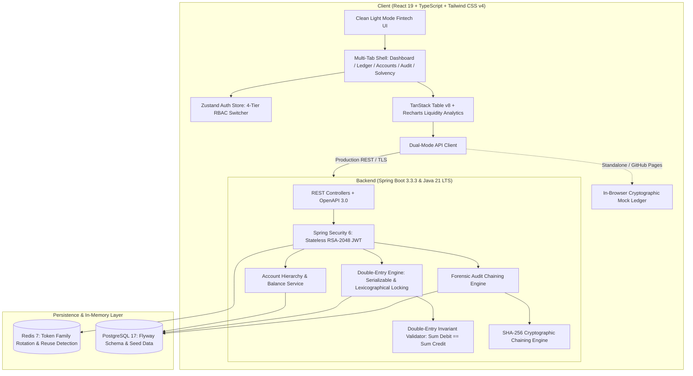
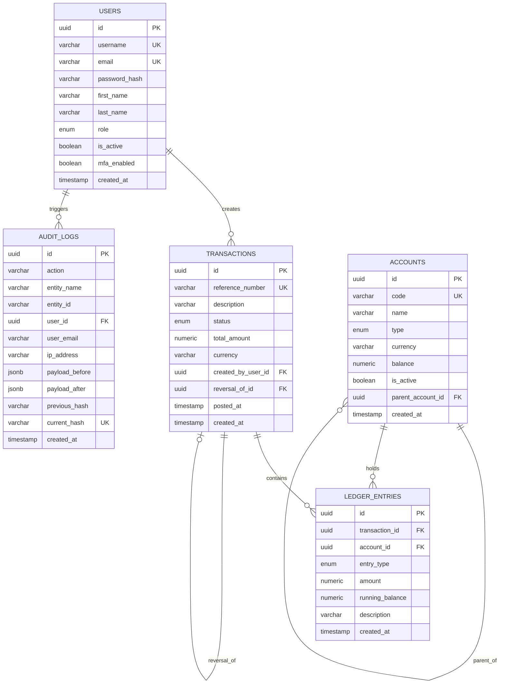

# VaultLedger Core — Plataforma Financiera de Contabilidad de Partida Doble & Auditoría Criptográfica

<div align="center">


**Plataforma corporativa de infraestructura bancaria, motor transaccional de Libro Mayor de Partida Doble (*Double-Entry Ledger*), prevención de *deadlocks* con bloqueo pesimista ordenado, autenticación asimétrica RSA-2048 y pista de auditoría forense inmutable encadenada con hashes SHA-256.**

[🚀 Demo en Vivo (GitHub Pages)](https://alxnrocha.github.io/java-secure-platform/) • [📂 Repositorio en GitHub](https://github.com/alxnrocha/java-secure-platform) • [📄 Swagger OpenAPI Docs](http://localhost:8080/swagger-ui.html)

</div>

---

## 🏛️ Arquitectura del Sistema



---

## ✨ Características Principales & Capacidades

### 1. ⚖️ Motor Transaccional de Partida Doble (*Double-Entry Ledger Engine*)
- **Invariante Contable Rigurosa**: Validación en tiempo de ejecución de que $\sum \text{Débitos} = \sum \text{Créditos} > 0$ ($\Delta = €0.00$).
- **Aislamiento `SERIALIZABLE` & Bloqueo Pesimista Ordenado**: Prevención total de *deadlocks* ordenando siempre los códigos de cuenta alfabéticamente (`TreeSet<String>`) antes de invocar `PESSIMISTIC_WRITE`.
- **Inmutabilidad & Estornos (*Reversals*)**: Cumplimiento de normativas bancarias internacionales (GAAP / IFRS). Los registros contables confirmados jamás se eliminan; se generan asientos inversos compensatorios vinculados al identificador de la transacción original (`reversalOfId`).
- **Terminal de Transferencias Atómicas**: Modal en 2 pasos con cálculo en vivo del impacto patrimonial y sello biométrico de confirmación.

### 2. 🔍 Pista de Auditoría Forense Criptográfica (*SHA-256 Blockchain-like Chain*)
- **Encadenamiento Criptográfico de Bloques**: Cada mutación crítica genera un registro inmutable cuyo hash incorpora el hash del bloque predecesor.
- **Verificación de Cadena en Tiempo Real**: Endpoint `/api/v1/audit/verify` e interfaz gráfica que auditan el 100% de los eslabones desde el Bloque Génesis.
- **Simulador Interactivo de Manipulación (*Tamper Demo*)**: Permite inyectar alteraciones en memoria para comprobar la detección inmediata del índice y bloque corrompidos.
- **Gaveta Lateral de Inspección (*Diff Viewer*)**: Comparador visual JSON (Antes vs Después), metadatos forenses (IP, Email, Timestamp) y eslabonamiento (*Prev, Current, Next*).

### 3. 📊 Dashboard de Solvencia & Liquidez (*CFO / Risk Management*)
- **Ratios Regulatorios (Basilea III)**: Ratio de Solvencia (2.29x), Ratio de Capital sobre Activos (54.76%) y Apalancamiento D/E (0.80x) con insignias de cumplimiento.
- **Gráficos Interactivos con Recharts**: Curvas de flujo de liquidez a 30 días (*Inbound vs Outbound*) y gráfico comparativo de la Ecuación Patrimonial ($\text{Activo} = \text{Pasivo} + \text{Patrimonio}$).

### 4. 🔐 Seguridad Bancaria, Criptografía Asimétrica & Matriz RBAC
- **Claves Asimétricas RSA-2048**: Emisión y validación de tokens JWT firmados digitalmente mediante el algoritmo `RSASSA-PSS (SHA-256)`.
- **Rotación de Refresh Tokens en Redis 7**: Detección automática de ataques por reutilización de tokens (*Token Reuse Detection*) con revocación en cascada de toda la familia de sesiones.
- **Matriz de Permisos RBAC de 4 Niveles**:
  - `ROLE_ADMIN`: Acceso total (creación de cuentas, transferencias, estornos y auditoría).
  - `ROLE_OPERATOR`: Consulta de catálogo y emisión de transferencias autorizadas.
  - `ROLE_AUDITOR`: Inspección forense y verificación de integridad criptográfica (solo lectura).
  - `ROLE_COMPLIANCE_OFFICER`: Autorización de estornos contables e inspección regulatoria.

---

## 🗄️ Esquema de Base de Datos y Modelo Entidad-Relación



---

## 📐 Invariantes Matemáticas & Fórmulas Criptográficas

### 1. Invariante de Partida Doble
$$\sum_{i=1}^{n} \text{Débito}_i = \sum_{j=1}^{m} \text{Crédito}_j > 0 \quad\implies\quad \Delta = \left(\sum \text{Débitos} - \sum \text{Créditos}\right) = €0.00$$

### 2. Ecuación Patrimonial Fundamental
$$\text{Activo} = \text{Pasivo} + \text{Patrimonio Neto} + (\text{Ingresos} - \text{Gastos})$$

### 3. Cadena Hash Criptográfica SHA-256
$$\text{Hash}_k = \text{SHA-256}\Big(\text{Hash}_{k-1} \mathbin{\Vert} \text{Action} \mathbin{\Vert} \text{Entity} \mathbin{\Vert} \text{EntityID} \mathbin{\Vert} \text{UserEmail} \mathbin{\Vert} \text{Payload}\Big)$$

$$\text{Bloque Génesis: } \text{Hash}_0 = \mathtt{0000000000000000000000000000000000000000000000000000000000000000}$$

---

## 🗂️ Estructura del Proyecto

```text
19-java-secure-platform/
├── .github/
│   └── workflows/
│       └── ci.yml                         # Pipeline GitHub Actions (Maven + Vitest + GitHub Pages)
├── client/                                # Frontend SPA (React 19, TypeScript, Tailwind v4, Vite)
│   ├── src/
│   │   ├── api/                           # Dual-Mode API Client (REST Backend + In-Browser Engine)
│   │   ├── components/                    # Header, Sidebar, Ledger, Accounts, TransferModal, AuditTrail, Solvency
│   │   ├── data/                          # Deterministic 12-Transaction Seed & In-Memory SHA-256 Engine
│   │   ├── stores/                        # Zustand Store para Autenticación y Matriz RBAC
│   │   ├── types/                         # Tipos TypeScript contables, transaccionales y de seguridad
│   │   ├── App.tsx                        # Layout Shell y Enrutamiento por Pestañas
│   │   └── main.tsx                       # Punto de entrada React 19
│   ├── tests/                             # Suite de pruebas unitarias Vitest (15 pruebas aprobadas)
│   ├── vite.config.ts                     # Configuración de base path para GitHub Pages
│   └── package.json
├── server/                                # Backend REST API (Spring Boot 3.3.3 & Java 21 LTS)
│   ├── src/main/java/com/alxnrocha/vaultledger/
│   │   ├── account/                       # Gestión de Catálogo de Cuentas y Jerarquías
│   │   ├── audit/                         # Motor de Auditoría Forense y Verificación SHA-256
│   │   ├── common/                        # Manejador Global de Excepciones RFC 7807 y ApiResponse
│   │   ├── config/                        # Configuración OpenAPI 3.0 Swagger y CORS
│   │   ├── ledger/                        # Motor de Partida Doble y Bloqueo Pesimista Ordenado
│   │   ├── security/                      # Proveedor RSA-2048, Filtro JWT y Redis Token Store
│   │   └── user/                          # Entidades de Usuario y Matriz RBAC
│   ├── src/main/resources/
│   │   ├── db/migration/                  # Migraciones Flyway (V1 Schema + V2 Fintech Seed)
│   │   └── application.yml
│   └── src/test/java/                     # Suite de pruebas unitarias y de integración JUnit 5 / Mockito (41 pruebas)
├── docker-compose.yml                     # Orquestación local de PostgreSQL 17 y Redis 7
├── LICENSE                                # Licencia MIT
└── README.md                              # Documentación Técnica Ejecutiva
```

---

## 🚀 Guía de Instalación y Ejecución Local

### Prerrequisitos
- **Java 21 LTS** (Eclipse Temurin / OpenJDK)
- **Maven 3.9+**
- **Node.js 22 LTS & npm**
- **Docker & Docker Compose** (opcional para PostgreSQL y Redis locales)

### 1. Clonar el Repositorio
```bash
git clone https://github.com/alxnrocha/java-secure-platform.git
cd java-secure-platform
```

### 2. Iniciar Servicios de Infraestructura (Docker)
```bash
docker-compose up -d
```

### 3. Ejecutar el Backend (Spring Boot 3.3.3)
```bash
cd server
mvn clean spring-boot:run
```
- API activa en: `http://localhost:8080`
- Documentación Swagger OpenAPI: `http://localhost:8080/swagger-ui.html`

### 4. Ejecutar el Cliente (React 19 + Vite)
```bash
cd ../client
npm install
npm run dev
```
- Aplicación activa en: `http://localhost:5173/`

---

## 🧪 Suite de Pruebas Automatizadas

El proyecto cuenta con una cobertura integral de pruebas unitarias, de integración, de seguridad y de consistencia contable:

```bash
# Ejecutar pruebas del backend (JUnit 5, Mockito, Spring Security RBAC)
cd server
mvn test

# Ejecutar pruebas del frontend (Vitest, React Testing Library)
cd ../client
npm run test
```

### Resumen de Pruebas:
| Capa | Framework | Pruebas | Resultado |
| :--- | :--- | :---: | :---: |
| **Backend** | JUnit 5 + Mockito + Spring Security Test | **41 / 41** | ✅ `BUILD SUCCESS` |
| **Frontend** | Vitest + React Testing Library + JSDOM | **15 / 15** | ✅ `PASSED` |

---

## 📄 Licencia

Distribuido bajo la Licencia **MIT**. Consulta el archivo [`LICENSE`](LICENSE) para más detalles.

---

<div align="center">

**Desarrollado por [Alexandre Rocha](https://github.com/alxnrocha)**  
*Senior Full-Stack & Systems Engineer • Java & Modern Web Ecosystems*

</div>
